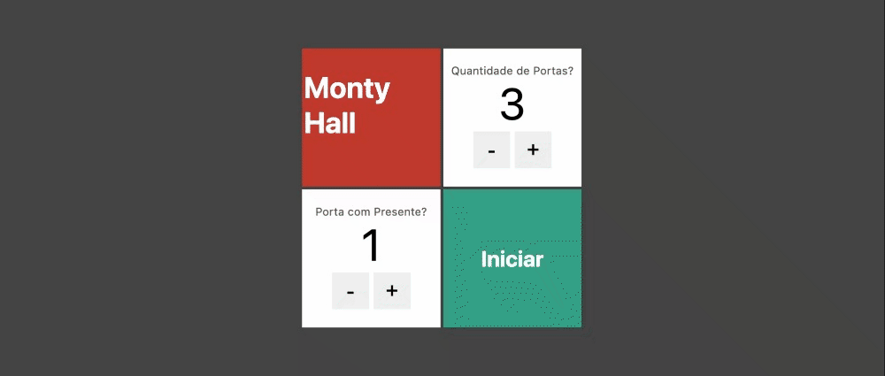

# Curso de NextJS

Curso ministrado pela CODER -
[Next.js e React - Curso Completo - Aprenda com Projetos](https://www.udemy.com/course/nextjs-e-react/)

## Mudulo Realizado 

- **Section 04:** Projeto Porta Oremiada - Aplicando os Conceitos Fundamentais

Criando aplicação basica da porta dos desesperados, aplicando quantidade de portas e qual porta está o presente. Voce pode selecionar a porta e abrir as portas clicando na maçaneta. 

 

Selecionando porta com o premio.

 

Selecionando Quantidade de portas e qual porta é que está o presente.

Validação quando a porta com o presente é invalida.

